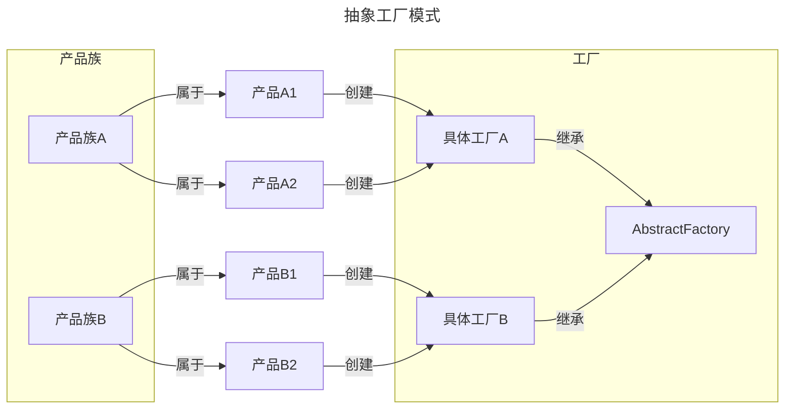

### 定义

抽象工厂模式(Abstract Factory)就是通过类的抽象使得业务适用于一个产品类簇的创建，而不负责某一类产品的实例。

### 示例

情景：不同品牌的手机，在不同工厂中生产

::: normal-demo 抽象工厂模式

```js
class AbstractMobileFactory {
  constructor() {
    new Error('抽象工厂模式不能被实例化');
  }
   // 提供操作系统的接口
  createOS(){
    throw new Error("抽象工厂方法不允许直接调用，你需要将我重写！");
  }
  // 提供硬件的接口
  createHardWare(){
    throw new Error("抽象工厂方法不允许直接调用，你需要将我重写！");
  }
}

class AndroidFactory extends AbstractMobileFactory {
  createOS() {
    console.log("创建安卓系统");
  }
  createHardWare() {
    console.log("创建安卓硬件");
  }
}

class IOSFactory extends AbstractMobileFactory {
  createOS() {
    console.log("创建苹果系统");
  }
  createHardWare() {
    console.log("创建苹果硬件");
  }
}

const factorys = new Map([
  ['AndroidFactory', AndroidFactory],
  ['IOSFactory',IOSFactory]
]);

function createMobile(type) {
  if (factorys.get(type)) {
    const factory = factorys.get(type);
    return new factory();
  }
  throw new Error('type is not exist');
}

const android = createMobile('AndroidFactory');
android.createOS();
android.createHardWare();

```

:::

1. es5实现抽象
```js
/**
 * 使用es5实现抽象工厂模式
 *
 * 什么是抽象工厂模式，就是一个对象可以被其他对象继承，但自身不能被实例化
 */
function AbstractClass() {
  this.name = "AbstractClass";
  if (new.target === AbstractClass) {
    throw new Error("不能实例化抽象类");
  }
}

// 静态方法，抽象类里没必要定义静态方法
AbstractClass.test = function () {
  console.log("test");
};

AbstractClass.prototype.commonMethod = function () {
  throw new Error("抽象类不能调用抽象方法");
};

function ConcreteClass() {
  // 首先通过AbstractClass.call(this)来改变this的指向，使得ConcreteClass实例可以继承AbstractClass的属性和方法
  AbstractClass.call(this);
  this.name = "ConcreteClass";
  this.age = 12;
}

/**
 * 继承抽象类原型指向抽象类原型， new Object(), {}，Object.create区别
 * {}, Object.create(null)不会继承创建对象的属性，减少对象的遍历
 *
 * 通过Object.create(AbstractClass.prototype)来继承AbstractClass的原型属性和方法，并将ConcreteClass的原型指向AbstractClass的原型
 */

ConcreteClass.prototype = Object.create(AbstractClass.prototype);

ConcreteClass.prototype.constructor = ConcreteClass;

ConcreteClass.prototype.commonMethod = function () {
  console.log("commonMethod", this.name, this.age);
};

const concreteClass = new ConcreteClass();

/**
 * 报错：TypeError: ConcreteClass.test is not a function的错误
 * ConcreteClass并没有继承AbstractClass的test静态方法。静态方法是属于类本身（构造函数）的，而不是原型链的一部分，因此不能通过子类实例访问。要解决这个问题，你可以直接在ConcreteClass中定义一个同名的静态方法，或者在需要调用AbstractClass.test的地方使用AbstractClass.test()
 */
ConcreteClass.test();

```

2. es6 class 实现抽象
```js
// 定义抽象工厂接口
class AbstractFactory {
  createButton() {
    throw new Error("Method must be implemented.");
  }

  createTextBox() {
    throw new Error("Method must be implemented.");
  }
}

// 具体工厂1：针对Chrome浏览器
class ChromeFactory extends AbstractFactory {
  createButton() {
    return new ChromeButton();
  }

  createTextBox() {
    return new ChromeTextBox();
  }
}

// 具体工厂2：针对Firefox浏览器
class FirefoxFactory extends AbstractFactory {
  createButton() {
    return new FirefoxButton();
  }

  createTextBox() {
    return new FirefoxTextBox();
  }
}

// 抽象产品：按钮
class AbstractButton {
  constructor() {
    this.type = "abstract button";
  }
}

// 具体产品：Chrome按钮
class ChromeButton extends AbstractButton {
  constructor() {
    super();
    this.type = "Chrome button";
  }
}

// 具体产品：Firefox按钮
class FirefoxButton extends AbstractButton {
  constructor() {
    super();
    this.type = "Firefox button";
  }
}

// 抽象产品：文本框
class AbstractTextBox {
  constructor() {
    this.type = "abstract text box";
  }
}

// 具体产品：Chrome文本框
class ChromeTextBox extends AbstractTextBox {
  constructor() {
    super();
    this.type = "Chrome text box";
  }
}

// 具体产品：Firefox文本框
class FirefoxTextBox extends AbstractTextBox {
  constructor() {
    super();
    this.type = "Firefox text box";
  }
}

// 使用抽象工厂模式
function createUIElements(browser) {
  if (browser === "Chrome") {
    const factory = new ChromeFactory();
    return {
      button: factory.createButton(),
      textBox: factory.createTextBox(),
    };
  } else if (browser === "Firefox") {
    const factory = new FirefoxFactory();
    return {
      button: factory.createButton(),
      textBox: factory.createTextBox(),
    };
  } else {
    throw new Error("Unsupported browser.");
  }
}

// 示例使用
const chromeElements = createUIElements("Chrome");
console.log(chromeElements.button.type); // 输出："Chrome button"
console.log(chromeElements.textBox.type); // 输出："Chrome text box"

const firefoxElements = createUIElements("Firefox");
console.log(firefoxElements.button.type); // 输出："Firefox button"
console.log(firefoxElements.textBox.type); // 输出："Firefox text box"
```
