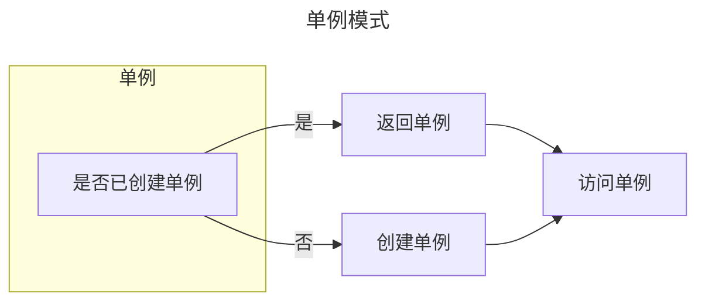

### 定义

保证一个类仅有一个实例，并提供一个访问它的全局访问点，这样的模式就叫做单例模式。

### 示例

1. 使用对象字面量实现单例模式
```js
// 创建一个函数，该函数返回一个对象字面量
function singleton() {
  // 如果已经创建了实例，就直接返回
  if (singleton.instance) {
    return singleton.instance;
  }

  // 创建对象字面量
  const instance = {
    property: 'some value',
    method: function() {
      console.log('Hello, World!');
    }
  };

  // 将实例存储为静态属性
  singleton.instance = instance;

  // 返回实例
  return instance;
}

// 第一次调用时，会创建单例
const firstInstance = singleton();
console.log(firstInstance.property); // 输出: "some value"
firstInstance.method(); // 输出: "Hello, World!"

// 再次调用时，将返回相同的实例
const secondInstance = singleton();
console.log(secondInstance === firstInstance); // 输出: true
```

2. 使用静态属性实现单例模式
```js
function Singleton() {
  if(typeof Singleton.instance !== 'object'){
     Singleton.instance = this;
  }
  return Singleton.instance;
}

const singleton1 = new Singleton();
const singleton2 = new Singleton();
console.log(singleton1 === singleton2); // true
```

3. 使用闭包实现单例模式
```js
function Singleton() {
  let instance = this;
  Singleton = function (){
    return instance;
  }
}

const singleton1 = new Singleton();
const singleton2 = new Singleton();
console.log(singleton1 === singleton2);
```

4. 使用模块模式实现单例模式
```js
const Singleton = (function() {
  let instance;

  function createInstance() {
    const object = {
      property: 'some value',
      method: function() {
        console.log('Hello, World!');
      }
    };

    return object;
  }

  return {
    getInstance: function() {
      if (!instance) {
        instance = createInstance();
      }
      return instance;
    }
  };
})();

// 获取单例
const firstInstance = Singleton.getInstance();
console.log(firstInstance.property); // 输出: "some value"
firstInstance.method(); // 输出: "Hello, World!"

// 再次获取单例
const secondInstance = Singleton.getInstance();
console.log(secondInstance === firstInstance); // 输出: true
```

5. 使用类实现单例模式

```js
class Singleton {
    show() {
        console.log('我是一个单例对象')
    }
    static getInstance() {
        // 判断是否已经new过1个实例
        if (!SingleDog.instance) {
            // 若这个唯一的实例不存在，那么先创建它
            SingleDog.instance = new SingleDog()
        }
        // 如果这个唯一的实例已经存在，则直接返回
        return SingleDog.instance
    }
}

const s1 = Singleton.getInstance()
const s2 = Singleton.getInstance()

// true
s1 === s2
```