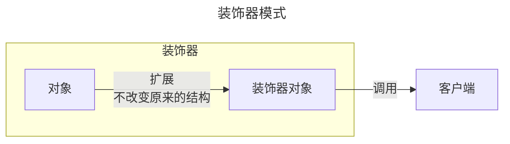

### 定义

装饰器模式（Decorator Pattern）允许向一个现有的对象添加新的功能，同时又不改变其结构。这种类型的设计模式属于结构型模式，它是作为现有的类的一个包装。

### 示例

1. es6 示例

es7可以使用装饰器语法糖实现

```js
// 定义打开按钮
class OpenButton {
    // 点击后展示弹窗（旧逻辑）
    onClick() {
        const modal = new Modal()
    	  modal.style.display = 'block'
    }
}

// 定义按钮对应的装饰器
class Decorator {
    // 将按钮实例传入
    constructor(open_button) {
        this.open_button = open_button
    }
    
    onClick() {
        this.open_button.onClick()
        // “包装”了一层新逻辑
        this.changeButtonStatus()
    }
    
    changeButtonStatus() {
        this.changeButtonText()
        this.disableButton()
    }
    
    disableButton() {
        const btn =  document.getElementById('open')
        btn.setAttribute("disabled", true)
    }
    
    changeButtonText() {
        const btn = document.getElementById('open')
        btn.innerText = '快去登录'
    }
}

const openButton = new OpenButton()
const decorator = new Decorator(openButton)

document.getElementById('open').addEventListener('click', function() {
    // openButton.onClick()
    // 此处可以分别尝试两个实例的onClick方法，验证装饰器是否生效
    decorator.onClick()
})
```